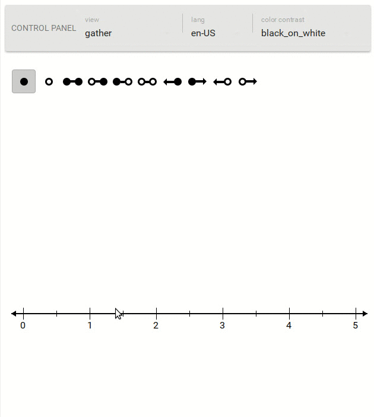

# @pie-element/number-line



A [pie](https://www.npmjs.com/package/pie) interaction that renders an interactive number line.

## Demo 

```shell
npm install -g pie
git clone git@github.com:pie-framework/pie-elements.git
cd packages/number-line
pie info 
```

### Test 

```shell 
npm test
```

#### port

This interaction is a port of a corespring internal component and due to this the data model is the same as that internal component's.

All properties work except for: 
* model.config.tickOverrides - wont support

